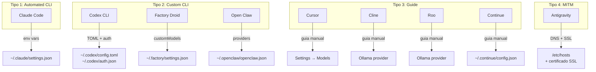
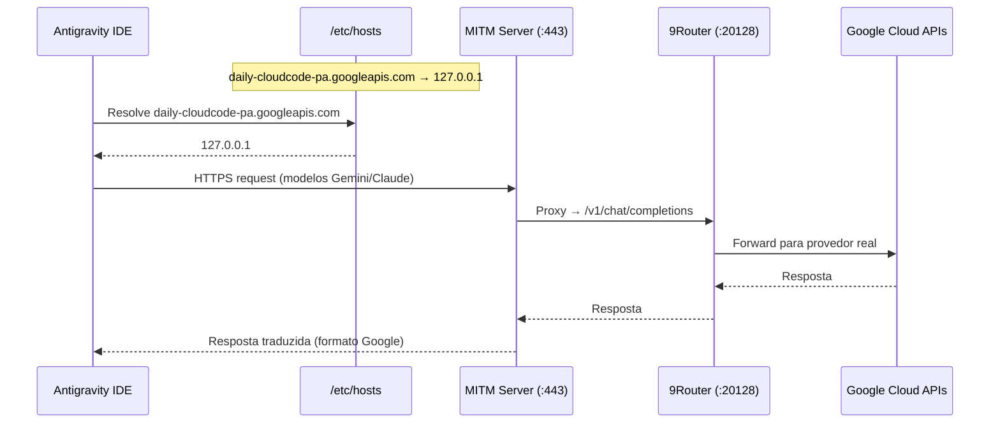

# Análise de Integrações CLI Tools — 9Router

## Visão Geral

A página CLI Tools permite configurar ferramentas de desenvolvimento externas para usar os modelos roteados pelo 9Router. Existem **9 ferramentas** divididas em **4 tipos de integração** com complexidade crescente:

| Tipo              | Ferramentas                  | Automação      | Descrição                            |
| ----------------- | ---------------------------- | -------------- | ------------------------------------ |
| **Automated CLI** | Claude Code                  | ✅ Apply/Reset | Modifica config diretamente no disco |
| **Custom CLI**    | Codex, Droid, OpenClaw       | ✅ Apply/Reset | Formato de config específico cada um |
| **Guide**         | Cursor, Cline, Roo, Continue | ❌ Manual      | Exibe instruções passo-a-passo       |
| **MITM**          | Antigravity                  | ✅ Start/Stop  | Proxy MITM com DNS redirect + SSL    |



---

## Detecção de Runtime

Antes de tudo, o sistema verifica se cada CLI está instalada via [cliRuntime.js](file:///home/diegosouzapw/dev/proxys/9router/src/shared/services/cliRuntime.js):

1. Busca o binário via `which`/`where` no PATH
2. Executa `--version` ou `-v` como healthcheck
3. Retorna status: `installed`, `runnable`, `runtimeMode`

Ferramentas que **NÃO precisam de binário** (`requiresBinary: false`): Cline, Roo, Continue — são extensões VS Code.

---

## Caso 1: Claude Code

| Item          | Detalhe                                                                                                                                  |
| ------------- | ---------------------------------------------------------------------------------------------------------------------------------------- |
| **Tipo**      | Automated CLI (`configType: "env"`)                                                                                                      |
| **Binário**   | `claude` (requer instalação)                                                                                                             |
| **Config**    | `~/.claude/settings.json`                                                                                                                |
| **API Route** | [claude-settings/route.js](file:///home/diegosouzapw/dev/proxys/9router/src/app/api/cli-tools/claude-settings/route.js)                  |
| **Card UI**   | [ClaudeToolCard.js](<file:///home/diegosouzapw/dev/proxys/9router/src/app/(dashboard)/dashboard/cli-tools/components/ClaudeToolCard.js>) |

### Como Funciona

O Claude Code lê variáveis de ambiente de `~/.claude/settings.json`. O 9Router modifica automaticamente esse arquivo:

```json
{
  "env": {
    "ANTHROPIC_BASE_URL": "http://localhost:20128/v1",
    "ANTHROPIC_AUTH_TOKEN": "sk-xxx",
    "ANTHROPIC_DEFAULT_OPUS_MODEL": "cc/claude-opus-4-5",
    "ANTHROPIC_DEFAULT_SONNET_MODEL": "cc/claude-sonnet-4-5",
    "ANTHROPIC_DEFAULT_HAIKU_MODEL": "cc/claude-haiku-4-5"
  }
}
```

### Fluxo de Configuração

1. **GET** → Detecta binário `claude`, lê settings.json, verifica se `ANTHROPIC_BASE_URL` já existe
2. **POST** (`Apply`) → Escreve env vars no settings.json com merge (preserva outras configs)
3. **DELETE** (`Reset`) → Remove apenas as chaves do 9Router, preserva o resto

### Benefício

Redireciona **todas as chamadas** do Claude Code para o 9Router, permitindo usar qualquer modelo de qualquer provedor com mapeamento de aliases (opus → modelos reais, sonnet → modelos reais, etc).

### Model Mapping

Claude Code usa aliases internos: `default`, `sonnet`, `opus`, `haiku`, `opusplan`. Cada alias pode ser mapeado para qualquer modelo disponível no 9Router.

---

## Caso 2: OpenAI Codex CLI

| Item          | Detalhe                                                                                                                                |
| ------------- | -------------------------------------------------------------------------------------------------------------------------------------- |
| **Tipo**      | Custom CLI (`configType: "custom"`)                                                                                                    |
| **Binário**   | `codex` (requer instalação)                                                                                                            |
| **Config**    | `~/.codex/config.toml` + `~/.codex/auth.json`                                                                                          |
| **API Route** | [codex-settings/route.js](file:///home/diegosouzapw/dev/proxys/9router/src/app/api/cli-tools/codex-settings/route.js)                  |
| **Card UI**   | [CodexToolCard.js](<file:///home/diegosouzapw/dev/proxys/9router/src/app/(dashboard)/dashboard/cli-tools/components/CodexToolCard.js>) |

### Como Funciona

O Codex CLI usa **TOML** para configuração e **JSON** para autenticação. O 9Router modifica ambos os arquivos:

**config.toml:**

```toml
model = "ag/claude-opus-4-5-thinking"
model_provider = "9router"

[model_providers.9router]
name = "9Router"
base_url = "http://localhost:20128/v1"
wire_api = "responses"
```

**auth.json:**

```json
{
  "OPENAI_API_KEY": "sk-xxx"
}
```

### Fluxo de Configuração

1. **GET** → Detecta binário, lê config.toml, verifica se `model_provider = "9router"` existe
2. **POST** → Cria seção `[model_providers.9router]` no TOML + salva API key no auth.json
3. **DELETE** → Remove apenas seção 9router do TOML + remove `OPENAI_API_KEY` do auth.json

### Particularidade

Usa `wire_api = "responses"` (Responses API format, não Chat Completions). O Codex tem parsers TOML customizados no backend.

---

## Caso 3: Factory Droid

| Item          | Detalhe                                                                                                                                |
| ------------- | -------------------------------------------------------------------------------------------------------------------------------------- |
| **Tipo**      | Custom CLI (`configType: "custom"`)                                                                                                    |
| **Binário**   | `droid` (requer instalação)                                                                                                            |
| **Config**    | `~/.factory/settings.json`                                                                                                             |
| **API Route** | [droid-settings/route.js](file:///home/diegosouzapw/dev/proxys/9router/src/app/api/cli-tools/droid-settings/route.js)                  |
| **Card UI**   | [DroidToolCard.js](<file:///home/diegosouzapw/dev/proxys/9router/src/app/(dashboard)/dashboard/cli-tools/components/DroidToolCard.js>) |

### Como Funciona

O Factory Droid usa `customModels` array no settings.json. O 9Router injeta um custom model apontando para o endpoint local:

```json
{
  "customModels": [
    {
      "model": "ag/claude-opus-4-5-thinking",
      "id": "custom:9Router-0",
      "index": 0,
      "baseUrl": "http://localhost:20128/v1",
      "apiKey": "sk-xxx",
      "displayName": "ag/claude-opus-4-5-thinking",
      "maxOutputTokens": 131072,
      "provider": "openai"
    }
  ]
}
```

### Fluxo

1. **GET** → Detecta binário, lê settings.json, procura `custom:9Router-0` no array
2. **POST** → Remove config anterior do 9Router (se existir), adiciona novo customModel no **início** do array
3. **DELETE** → Remove apenas itens com `id === "custom:9Router-0"`

---

## Caso 4: Open Claw

| Item          | Detalhe                                                                                                                                      |
| ------------- | -------------------------------------------------------------------------------------------------------------------------------------------- |
| **Tipo**      | Custom CLI (`configType: "custom"`)                                                                                                          |
| **Binário**   | `openclaw` (requer instalação, healthcheck até 12s)                                                                                          |
| **Config**    | `~/.openclaw/openclaw.json`                                                                                                                  |
| **API Route** | [openclaw-settings/route.js](file:///home/diegosouzapw/dev/proxys/9router/src/app/api/cli-tools/openclaw-settings/route.js)                  |
| **Card UI**   | [OpenClawToolCard.js](<file:///home/diegosouzapw/dev/proxys/9router/src/app/(dashboard)/dashboard/cli-tools/components/OpenClawToolCard.js>) |

### Como Funciona

Usa uma estrutura de providers em `models.providers`:

```json
{
  "agents": {
    "defaults": {
      "model": {
        "primary": "9router/ag/claude-opus-4-5-thinking"
      }
    }
  },
  "models": {
    "providers": {
      "9router": {
        "baseUrl": "http://localhost:20128/v1",
        "apiKey": "sk-xxx",
        "api": "openai-completions",
        "models": [
          {
            "id": "ag/claude-opus-4-5-thinking",
            "name": "claude-opus-4-5-thinking"
          }
        ]
      }
    }
  }
}
```

### Fluxo

1. **GET** → Detecta binário, verifica se `models.providers["9router"]` existe
2. **POST** → Cria provider `9router` com API `openai-completions` + define como model primário
3. **DELETE** → Remove provider `9router` e limpa referência do agents.defaults

---

## Caso 5: Cursor

| Item             | Detalhe                                                 |
| ---------------- | ------------------------------------------------------- |
| **Tipo**         | Guide (`configType: "guide"`)                           |
| **Binário**      | `agent` ou `cursor` (detecta automaticamente)           |
| **Config**       | Manual via Settings UI                                  |
| **Requer Cloud** | ⚠️ **Sim** — Cursor roteia via seus próprios servidores |

### Como Funciona

Cursor é **guide-based** — o 9Router não modifica arquivos. Em vez disso, exibe instruções:

1. Abrir Settings → Models
2. Habilitar "OpenAI API key"
3. Colar Base URL (precisa ser **cloud URL**, pois Cursor não acessa localhost)
4. Colar API Key
5. Adicionar Custom Model

### Particularidade Crítica

> ⚠️ Cursor roteia requisições pelo seus próprios servidores. O endpoint local (`localhost`) **não funciona**. É necessário habilitar o **Cloud Endpoint** nas configurações do 9Router.

---

## Caso 6: Cline (VS Code)

| Item        | Detalhe                                               |
| ----------- | ----------------------------------------------------- |
| **Tipo**    | Guide (`configType: "guide"`)                         |
| **Binário** | Nenhum (`requiresBinary: false`) — é extensão VS Code |
| **Config**  | Manual via UI da extensão                             |

### Fluxo Manual

1. Abrir Settings da extensão Cline
2. Selecionar Provider → **Ollama**
3. Colar Base URL: `http://localhost:20128`
4. Colar API Key
5. Selecionar modelo

### Por que Ollama?

As extensões Cline/Roo usam o provider Ollama como "gateway genérico" — ele aceita qualquer base URL customizada, permitindo apontar para o 9Router.

---

## Caso 7: Roo (VS Code)

| Item        | Detalhe                       |
| ----------- | ----------------------------- |
| **Tipo**    | Guide (`configType: "guide"`) |
| **Binário** | Nenhum — extensão VS Code     |
| **Config**  | Manual via UI da extensão     |

Idêntico ao Cline em termos de fluxo. Mesmos passos: provider Ollama → Base URL → API Key → Modelo.

---

## Caso 8: Continue

| Item        | Detalhe                            |
| ----------- | ---------------------------------- |
| **Tipo**    | Guide (`configType: "guide"`)      |
| **Binário** | Nenhum — extensão VS Code          |
| **Config**  | `~/.continue/config.json` (manual) |

### Fluxo

1. Abrir `~/.continue/config.json`
2. Selecionar API Key
3. Selecionar Modelo
4. Adicionar bloco JSON ao array `models`:

```json
{
  "apiBase": "http://localhost:20128",
  "title": "ag/claude-opus-4-5-thinking",
  "model": "ag/claude-opus-4-5-thinking",
  "provider": "openai",
  "apiKey": "sk-xxx"
}
```

---

## Caso 9: Antigravity (MITM)

| Item            | Detalhe                                                                                                                               |
| --------------- | ------------------------------------------------------------------------------------------------------------------------------------- |
| **Tipo**        | MITM Proxy (`configType: "mitm"`)                                                                                                     |
| **Binário**     | Nenhum — usa proxy MITM interno                                                                                                       |
| **Config**      | DNS + Certificado SSL                                                                                                                 |
| **API Route**   | [antigravity-mitm/route.js](file:///home/diegosouzapw/dev/proxys/9router/src/app/api/cli-tools/antigravity-mitm/route.js)             |
| **Manager**     | [mitm/manager.js](file:///home/diegosouzapw/dev/proxys/9router/src/mitm/manager.js)                                                   |
| **Alias Route** | [antigravity-mitm/alias/route.js](file:///home/diegosouzapw/dev/proxys/9router/src/app/api/cli-tools/antigravity-mitm/alias/route.js) |

### Como Funciona

Esta é a integração mais avançada. Em vez de modificar configs de ferramentas, faz um **Man-In-The-Middle** interceptando tráfego HTTPS entre o IDE Antigravity e os servidores do Google.



### Componentes do MITM

| Componente         | Arquivo                     | Função                                  |
| ------------------ | --------------------------- | --------------------------------------- |
| **Manager**        | `src/mitm/manager.js`       | Orquestra start/stop do MITM            |
| **MITM Server**    | `src/mitm/server.js`        | Servidor HTTPS na porta 443             |
| **DNS Config**     | `src/mitm/dns/dnsConfig.js` | Adiciona/remove entrada em `/etc/hosts` |
| **Cert Generator** | `src/mitm/cert/generate.js` | Gera certificado SSL self-signed        |
| **Cert Installer** | `src/mitm/cert/install.js`  | Instala cert no keychain do sistema     |

### Fluxo de Ativação

1. **Gerar Certificado** SSL para `daily-cloudcode-pa.googleapis.com` (se não existir em `~/.9router/mitm/`)
2. **Instalar Certificado** no keychain do sistema (requer sudo)
3. **Adicionar DNS** → `127.0.0.1 daily-cloudcode-pa.googleapis.com` em `/etc/hosts` (sudo)
4. **Iniciar Servidor MITM** na porta 443 (Node.js HTTPS server)

### Fluxo de Desativação

1. **Matar processo** do servidor MITM
2. **Remover entrada DNS** do `/etc/hosts` (sudo)
3. **Limpar password cache** da memória

### Model Alias Mapping

A rota `/api/cli-tools/antigravity-mitm/alias` permite mapear modelos do Antigravity para modelos do 9Router:

- `claude-opus-4-5-thinking` → modelo real via proxy
- `gemini-3-pro-high` → modelo real via proxy

### Particularidades

- Requer **senha sudo** para operações de DNS e certificado
- A senha fica em **cache na memória** durante a sessão (não em disco)
- O PID do servidor é salvo em `~/.9router/mitm/.mitm.pid`

---

## Comparativo de Complexidade

| Ferramenta    | Detecção   | Config Automática | Requer Cloud | Requer Sudo | Formato Config      |
| ------------- | ---------- | ----------------- | ------------ | ----------- | ------------------- |
| Claude Code   | ✅ Binário | ✅                | ❌           | ❌          | JSON (env vars)     |
| Codex CLI     | ✅ Binário | ✅                | ❌           | ❌          | TOML + JSON         |
| Factory Droid | ✅ Binário | ✅                | ❌           | ❌          | JSON (customModels) |
| Open Claw     | ✅ Binário | ✅                | ❌           | ❌          | JSON (providers)    |
| Cursor        | ✅ Binário | ❌                | ⚠️ **SIM**   | ❌          | Manual              |
| Cline         | ❌         | ❌                | ❌           | ❌          | Manual              |
| Roo           | ❌         | ❌                | ❌           | ❌          | Manual              |
| Continue      | ❌         | ❌                | ❌           | ❌          | JSON manual         |
| Antigravity   | ❌         | ✅ MITM           | ❌           | ⚠️ **SIM**  | DNS + SSL           |

---

## Arquivos-Chave

| Arquivo                                                                                                                               | Função                             |
| ------------------------------------------------------------------------------------------------------------------------------------- | ---------------------------------- |
| [cliTools.js](file:///home/diegosouzapw/dev/proxys/9router/src/shared/constants/cliTools.js)                                          | Definição de todas as ferramentas  |
| [cliRuntime.js](file:///home/diegosouzapw/dev/proxys/9router/src/shared/services/cliRuntime.js)                                       | Detecção de binários e healthcheck |
| [CLIToolsPageClient.js](<file:///home/diegosouzapw/dev/proxys/9router/src/app/(dashboard)/dashboard/cli-tools/CLIToolsPageClient.js>) | Página principal do dashboard      |
| [mitm/manager.js](file:///home/diegosouzapw/dev/proxys/9router/src/mitm/manager.js)                                                   | Gerenciador do proxy MITM          |
